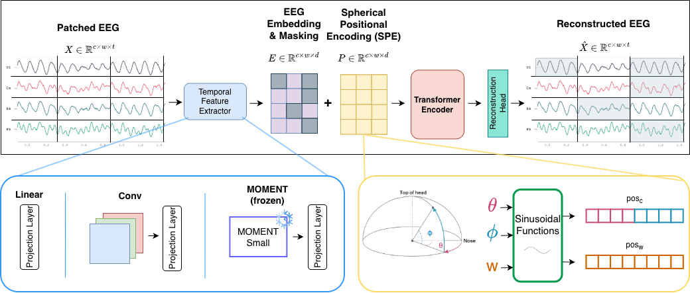

# Temporal Feature Extractors in EEG Foundation Models

Official repository for **“Temporal Feature Extractors in EEG Foundation Models: A Controlled Comparison Including a Pretrained Time-Series Model,”** accepted at the **2nd ICML Workshop on Foundation Models for Structured Data (2026)**.

[[Paper](https://arxiv.org/abs/2606.30104)] [[PDF](https://arxiv.org/pdf/2606.30104)]

> **Release status:** The paper is available, and the code is being prepared for public release.
> 
<p align="center">
  
</p>

## Overview

Temporal feature extractors are a central component of EEG foundation models, but their effect is often entangled with changes in model architecture, training objectives, and data. This work isolates their role through a controlled comparison in which the temporal feature extractor is changed while the remaining architecture, objective, and training setup are held fixed.

We compare three temporal feature extraction strategies:

- **Linear:** a linear projection of each EEG patch into the embedding space.
- **Conv:** depthwise temporal convolutions followed by pointwise convolution and projection.
- **MOMENT:** a frozen, pretrained MOMENT-Small encoder used independently on each channel-patch token, followed by projection into the EEG model embedding space.

All variants use the same transformer backbone, Spherical Positional Encoding, random token masking, and masked-reconstruction objective.

## Main findings

- No temporal feature extractor consistently achieves the highest average performance across all evaluated settings.
- On **PhysioNet-MI** motor imagery classification, simple temporal representations are competitive; the linear model obtains the highest average fine-tuning performance.
- On **FACED** emotion classification, the convolutional and MOMENT variants outperform the linear baseline on average under both linear probing and fine-tuning.
- A frozen, general-purpose time-series foundation model can serve as a competitive temporal feature extractor without EEG-specific adaptation.
- Post-hoc pairwise comparisons do not remain significant after Holm-Bonferroni correction, so the observed differences should be interpreted as descriptive trends rather than evidence of consistent model superiority.

## Method

Given a multichannel EEG recording, the model:

1. resamples the signal to 100 Hz and divides it into 2-second patches;
2. embeds each channel-patch token using Linear, Conv, or frozen MOMENT-Small features;
3. masks 50% of the tokens after temporal feature extraction;
4. adds Spherical Positional Encoding for electrode location and sinusoidal encoding for temporal position;
5. processes the tokens with a shared transformer encoder; and
6. reconstructs the masked EEG patches during pretraining.

For downstream evaluation, the reconstruction head is replaced with a single-layer classification head. We evaluate both linear probing and fine-tuning while keeping the temporal feature extractors frozen in all variants.

## Datasets and tasks

| Stage | Dataset | Task | Subjects | Channels |
|---|---|---|---:|---:|
| Pretraining | Healthy Brain Network EEG (HBN-EEG) | Masked EEG reconstruction | 2,449 | 128 |
| Downstream | PhysioNet EEG Motor Movement/Imagery | 4-class motor imagery | 109 | 64 |
| Downstream | FACED | 9-class emotion recognition | 123 | 32 |

All downstream splits are subject-independent. Results are reported as mean ± SEM over six random seeds using balanced accuracy, Cohen’s kappa, and weighted F1.

## Results

### Linear probing

| Dataset | Extractor | Balanced Accuracy | Cohen’s Kappa | Weighted F1 |
|---|---|---:|---:|---:|
| PhysioNet-MI | Linear | **0.547 ± 0.008** | **0.397 ± 0.011** | 0.546 ± 0.008 |
| PhysioNet-MI | Conv | 0.546 ± 0.006 | 0.394 ± 0.008 | **0.547 ± 0.007** |
| PhysioNet-MI | MOMENT | 0.526 ± 0.008 | 0.369 ± 0.011 | 0.525 ± 0.010 |
| FACED | Linear | 0.362 ± 0.006 | 0.279 ± 0.006 | 0.358 ± 0.005 |
| FACED | Conv | 0.397 ± 0.012 | 0.318 ± 0.013 | 0.391 ± 0.010 |
| FACED | MOMENT | **0.398 ± 0.006** | **0.321 ± 0.007** | **0.393 ± 0.005** |

### Fine-tuning

| Dataset | Extractor | Balanced Accuracy | Cohen’s Kappa | Weighted F1 |
|---|---|---:|---:|---:|
| PhysioNet-MI | Linear | **0.582 ± 0.016** | **0.443 ± 0.021** | **0.583 ± 0.016** |
| PhysioNet-MI | Conv | 0.564 ± 0.009 | 0.418 ± 0.012 | 0.564 ± 0.011 |
| PhysioNet-MI | MOMENT | 0.576 ± 0.010 | 0.435 ± 0.013 | 0.576 ± 0.010 |
| FACED | Linear | 0.430 ± 0.018 | 0.356 ± 0.019 | 0.428 ± 0.016 |
| FACED | Conv | **0.454 ± 0.012** | **0.385 ± 0.013** | **0.453 ± 0.011** |
| FACED | MOMENT | 0.442 ± 0.012 | 0.369 ± 0.013 | 0.438 ± 0.011 |

Bold values indicate the highest mean within each dataset and evaluation protocol. These comparisons are descriptive; see the paper for the full statistical analysis.

## Repository contents

The release will include:

- preprocessing utilities;
- model implementations for the Linear, Conv, and MOMENT variants;
- pretraining and downstream evaluation scripts;
- experiment configurations; and
- instructions for reproducing the reported results.

## Code release

The implementation and reproducibility instructions are currently being prepared. Please watch this repository for updates.

## Citation

If you find this work useful, please cite:

```bibtex
@inproceedings{yuce2026temporal,
  title     = {Temporal Feature Extractors in {EEG} Foundation Models: A Controlled Comparison Including a Pretrained Time-Series Model},
  author    = {Y\"uce, Ay\c{s}e Bet\"ul and Leffler, Chris Joey and Varghese, Sarun and Spiliopoulou, Myra and Stober, Sebastian},
  booktitle = {Proceedings of the 2nd ICML Workshop on Foundation Models for Structured Data},
  year      = {2026},
  eprint    = {2606.30104},
  archivePrefix = {arXiv},
  primaryClass  = {cs.AI},
  doi       = {10.48550/arXiv.2606.30104}
}
```

## License

License information will be added with the code release.
